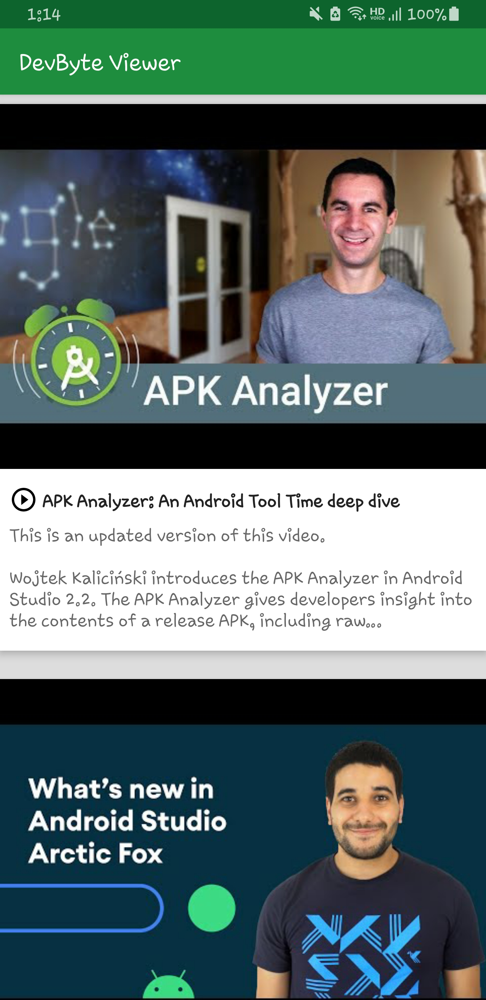
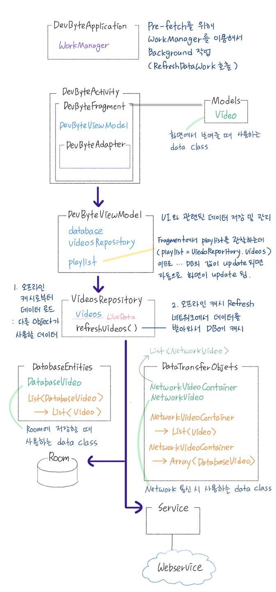

# Behind the Scenes - DevByte Viewer App

## DevByte

DevByte Viewer는 [Room](https://developer.android.com/topic/libraries/architecture/room)과 Repository를 사용하여 오프라인 캐시를 만드는 방법을 보여주는 예제 앱입니다.

또한, 정기적으로 이루어져야 하는 작업을 예약하기 위해 [WorkManager](https://developer.android.com/topic/libraries/architecture/workmanager)를 사용하는 방법도 다루고 있습니다. 이 앱에서는 매일 백그라운드 데이터를 동기화하는데 사용됩니다. 

## Screenshots

</img>
</img>

## Commit Version

* [ Strart Code ](https://github.com/ChaMinZi/Android_Basic_Sample/commit/422468e2a6b5e4d9ea435254df931026b19a8b26#diff-f9a50ab6054ba1ae986e2b934a2d8522740aebec75cbd4e7896cc7f677e2d121)

* [ Add a DatabaseVideo Entity and the VideoDao ](https://github.com/ChaMinZi/Android_Basic_Sample/commit/3941cd396b820263b37331fb96fdec94a5bcaee6#diff-f9a50ab6054ba1ae986e2b934a2d8522740aebec75cbd4e7896cc7f677e2d121)

* [ Add the VideosDatabase ](https://github.com/ChaMinZi/Android_Basic_Sample/commit/abbe5e106c0754ac1d81bd600f45ad1d71334d64#diff-f9a50ab6054ba1ae986e2b934a2d8522740aebec75cbd4e7896cc7f677e2d121)

* [ Build and Use the Repository ](https://github.com/ChaMinZi/Android_Basic_Sample/commit/3616e9e54bb59dff38d4eff066149d6bee90127d#diff-f9a50ab6054ba1ae986e2b934a2d8522740aebec75cbd4e7896cc7f677e2d121)

* [ Create a Worker ](https://github.com/ChaMinZi/Android_Basic_Sample/commit/9fb039cbf78dd01cfec3766a69a20e7afc46d5a6#diff-f9a50ab6054ba1ae986e2b934a2d8522740aebec75cbd4e7896cc7f677e2d121)

* [ Schedule Background Work ](https://github.com/ChaMinZi/Android_Basic_Sample/commit/55e16fd7e1b8793ba11c75eb515792341fbca59a#diff-f9a50ab6054ba1ae986e2b934a2d8522740aebec75cbd4e7896cc7f677e2d121)

## Structure

</img>

## 참고
[andfun-kotlin-dev-btyes](https://github.com/udacity/andfun-kotlin-dev-bytes)