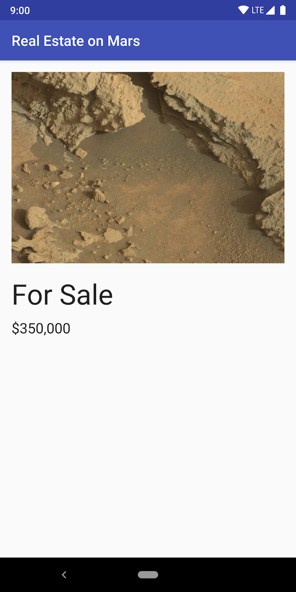

# Connect to the Internet - Mars Real Estate

## MarsRealEstate

MarsRealEstate APP은 ViewModel & LiveData와 함께 Retrofit, Glide, Moshi를 사용한 간단한 데모 앱입니다.

이 앱은 아래와 같은 기술들을 사용합니다.

* [Retrofit](https://square.github.io/retrofit/) to make api calls to an HTTP web service
* [Moshi](https://github.com/square/moshi) which handles the deserialization of the returned JSON to Kotlin data objects 
* [Glide](https://bumptech.github.io/glide/) to load and cache images by URL.
  
Jetpack library에서는 아래와 같은 components를 사용합니다.

* [ViewModel](https://developer.android.com/topic/libraries/architecture/viewmodel)
* [LiveData](https://developer.android.com/topic/libraries/architecture/livedata)
* [Data Binding](https://developer.android.com/topic/libraries/data-binding/) with binding adapters
* [Navigation](https://developer.android.com/topic/libraries/architecture/navigation/) with the SafeArgs plugin for parameter passing between fragments

## Screenshots

</img>
</img>
</img>
